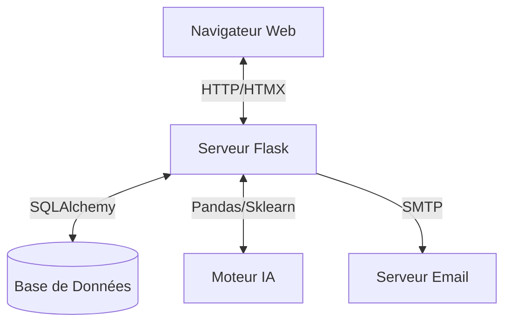

# 📘 Documentation Technique - ChurnGuard AI

## 1. Architecture Globale

ChurnGuard AI suit une architecture **MVC (Modèle-Vue-Contrôleur)** adaptée au framework Flask. L'application est conçue pour être modulaire, séparant clairement la logique de présentation, la logique métier et l'accès aux données.

### Diagramme Simplifié

---

## 2. Stack Technologique

### Backend
*   **Langage** : Python 3.9+
*   **Framework Web** : Flask (léger, flexible).
*   **ORM** : SQLAlchemy pour l'abstraction de la base de données.
*   **Authentification** : Flask-Login pour la gestion des sessions utilisateurs.

### Frontend
*   **Structure** : Templates Jinja2 (Rendu côté serveur).
*   **Styling** : Tailwind CSS (Utility-first framework) via CDN pour le prototypage rapide.
*   **Interactivité** : 
    *   **Alpine.js** : Pour la gestion d'état locale (modales, dropdowns, onglets) sans complexité.
    *   **HTMX** : Pour les requêtes AJAX déclaratives (chargement partiel, notifications).
*   **Visualisation** : Chart.js pour les graphiques (KPIs, Courbes).

### Data Science & IA
*   **Scikit-Learn** : Entraînement et inférence du modèle de prédiction (Random Forest).
*   **Pandas** : Manipulation des DataFrames pour le pré-traitement.
*   **Pickle** : Sérialisation du modèle entraîné (`model.pkl`).

---

## 3. Modèle de Données (Schéma BDD)

Les principales entités du système sont :

### `Tenant` (Locataire)
Représente une organisation cliente (Multi-tenancy).
*   `id`: UUID
*   `name`: String

### `User` (Utilisateur)
Les analystes ou administrateurs accédant à la plateforme.
*   `email`, `password_hash`, `role`, `avatar_url`.

### `Customer` (Client Final)
Les clients de l'entreprise utilisatrice, objets de l'analyse.
*   `external_id`: ID métier.
*   `churn_label`: Booléen (Target).
*   `persona`: Segment marketing (ex: "Price Sensitive").
*   `gender`, `senior_citizen`, `partner`, `dependents`.

### `Subscription` (Abonnement)
Détails contractuels liés au client.
*   `contract`: Type de contrat (Month-to-month, etc.).
*   `monthly_charges`: Montant mensuel.
*   `tenure`: Ancienneté en mois.
*   `internet_service`, `tech_support`, etc.

### `Notification` & `Campaign`
Gestion des événements système et des actions marketing.

---

## 4. Pipeline MLOps

Le cycle de vie du modèle IA est géré en interne :

1.  **Ingestion** : Les données sont chargées (simulé via `seed_data.py` ou connecteurs).
2.  **Pre-processing** : Encodage des variables catégorielles (One-Hot Encoding) et normalisation.
3.  **Entraînement** : `app/services/ml_service.py` entraîne un `RandomForestClassifier`.
4.  **Évaluation** : Calcul de la précision (Accuracy) et stockage des métriques.
5.  **Inférence** : Prédiction en temps réel ou par batch pour mettre à jour les scores de risque.
6.  **Monitoring** : Comparaison des distributions (Drift) via la page MLOps.

---

## 5. API Endpoints Clés

| Méthode | Endpoint | Description |
| :--- | :--- | :--- |
| `GET` | `/dashboard` | Vue principale avec KPIs. |
| `GET` | `/clients` | Liste filtrable des clients. |
| `POST` | `/api/train` | Déclenche le ré-entraînement du modèle. |
| `GET` | `/retention/preview/<id>` | Génère un email de rétention (GenAI). |
| `POST` | `/api/campaign/bulk` | Envoi massif d'emails. |
| `GET` | `/api/notifications` | Récupère les notifications (HTMX). |

---

## 6. Sécurité

*   **Mots de passe** : Hachage via `werkzeug.security` (PBKDF2/SHA256).
*   **Sessions** : Protection CSRF et cookies sécurisés.
*   **Uploads** : Validation stricte des extensions de fichiers (`secure_filename`).
*   **Accès** : Décorateur `@login_required` sur toutes les routes sensibles.
